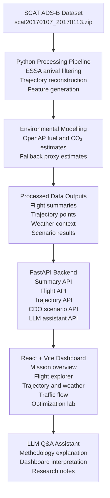
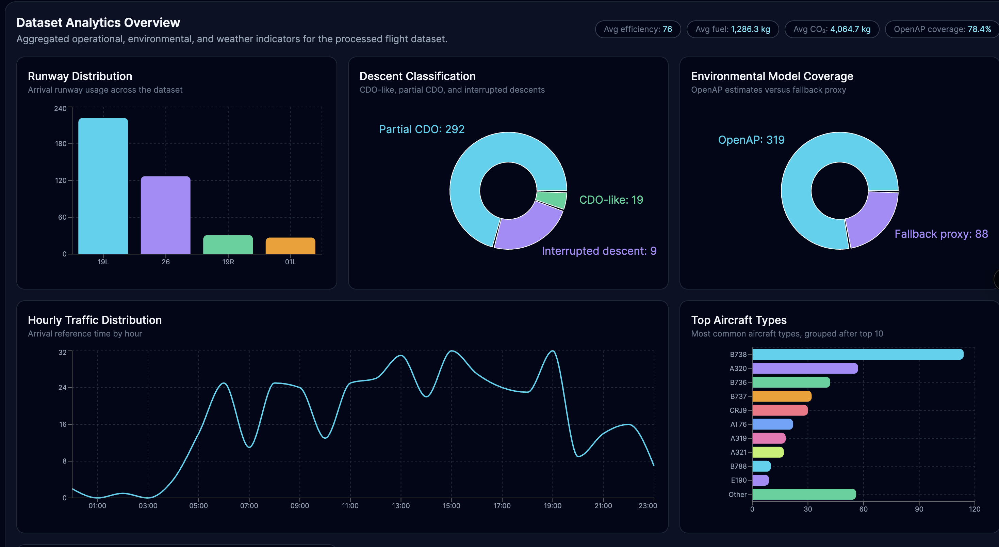
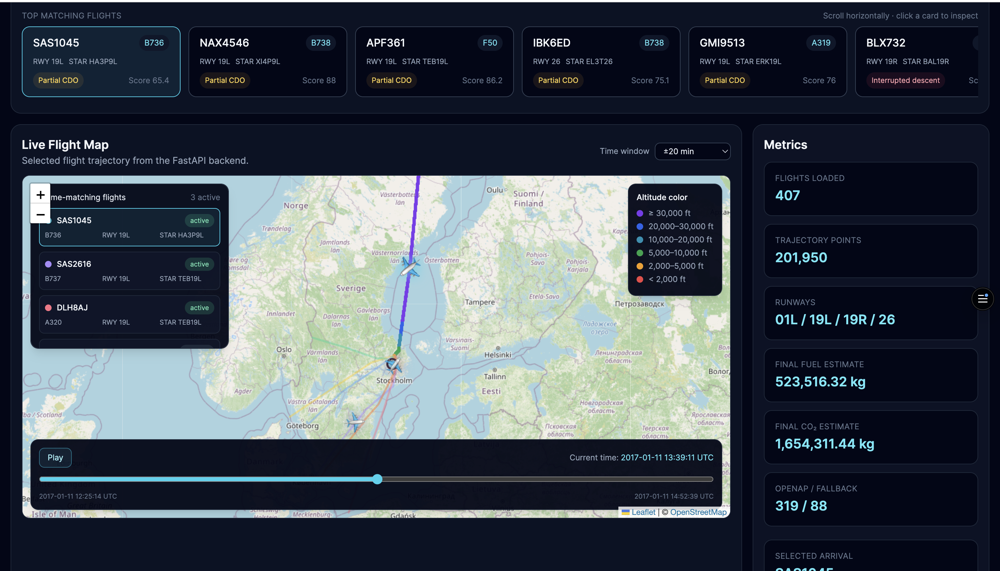
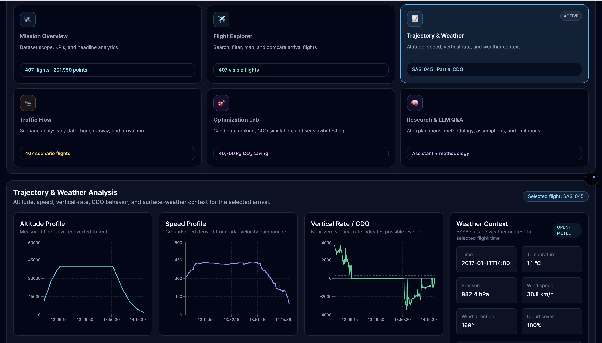
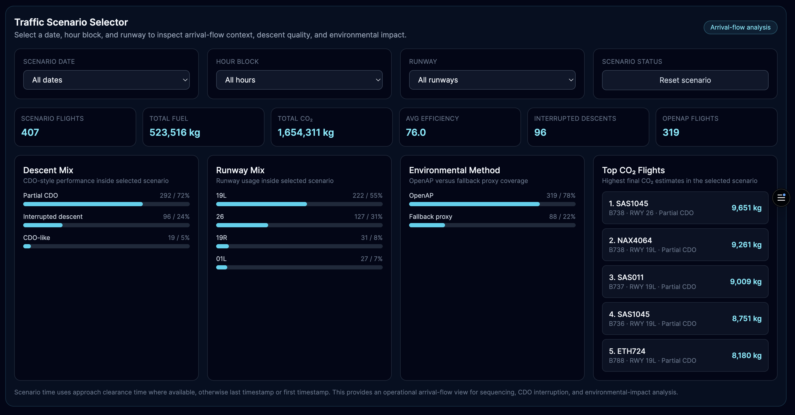
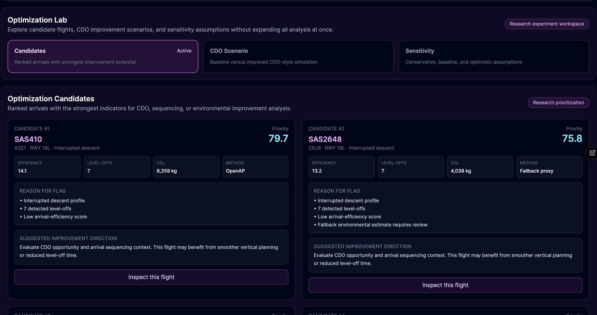
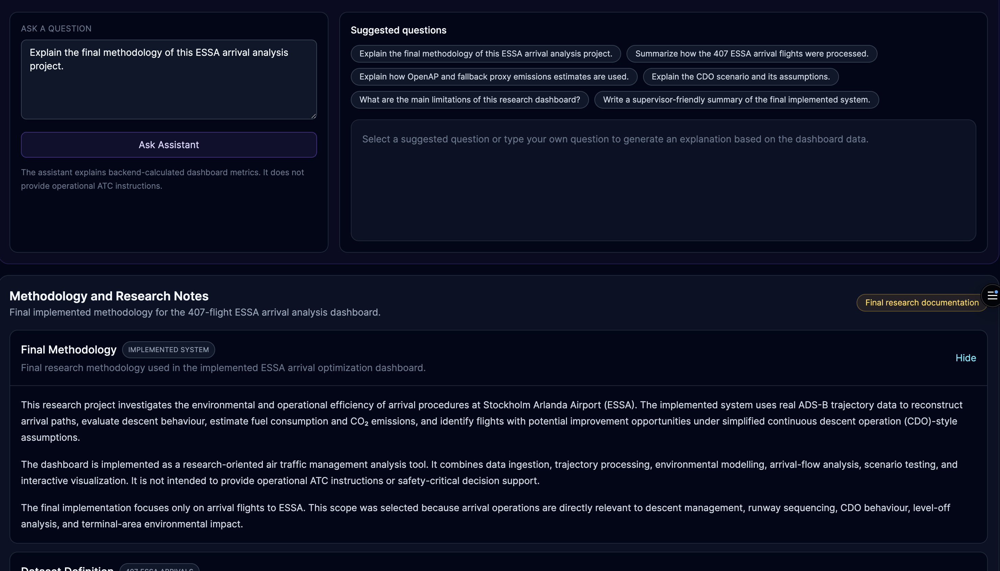

# LLM-Assisted Stockholm Arlanda Arrival Optimization Dashboard


A research-oriented aviation analytics dashboard for studying arrival operations at **Stockholm Arlanda Airport (ESSA)** using ADS-B trajectory data, environmental modelling, operational analytics, and an LLM-assisted explanation layer.

The project investigates how aircraft arrival trajectories can be analysed to support environmental and operational efficiency assessment in terminal airspace. It combines trajectory reconstruction, OpenAP-based fuel and CO₂ estimation, weather context, runway-flow analysis, CDO-style scenario testing, interactive visualization, and natural-language dashboard explanation.

This repository presents an aviation analytics portfolio project designed for review by aviation researchers, air traffic management specialists, environmental analysts, software engineers, and future contributors.

Link to live Dashboard: https://arlanda-airport-arrival-dashboard.vercel.app/

---

## Table of Contents

- [Project Overview](#project-overview)
- [Research Motivation](#research-motivation)
- [Research Questions](#research-questions)
- [Research Objectives](#research-objectives)
- [Dataset Description](#dataset-description)
- [Methodology Overview](#methodology-overview)
- [Key Assumptions](#key-assumptions)
- [System Architecture](#system-architecture)
- [Dashboard Features](#dashboard-features)
- [Dashboard Screenshots](#dashboard-screenshots)
- [Technology Stack](#technology-stack)
- [Repository Structure](#repository-structure)
- [Installation and Setup](#installation-and-setup)
- [Running the Project](#running-the-project)
- [Environment Variables](#environment-variables)
- [Deployment](#deployment)
- [Implemented Data Processing Pipeline](#implemented-data-processing-pipeline)
- [Environmental Modelling](#environmental-modelling)
- [Optimization and CDO Scenario Formulation](#optimization-and-cdo-scenario-formulation)
- [Key Results and Dataset Statistics](#key-results-and-dataset-statistics)
- [Research Contributions](#research-contributions)
- [Limitations](#limitations)
- [Future Work](#future-work)
- [References](#references)
- [Citation](#citation)
- [Acknowledgements](#acknowledgements)
- [License](#license)
- [Disclaimer](#disclaimer)
---

## Project Overview

This project is an interactive research dashboard for analysing aircraft arrivals at **Stockholm Arlanda Airport (ESSA)**.

The system processes ADS-B trajectory data and converts it into a complete aviation analytics workflow. It allows users to inspect arrival trajectories, compare flights, review runway and descent behaviour, estimate fuel consumption and CO₂ emissions, and explore simplified arrival-efficiency and CDO-style scenario analyses.

The platform supports:

- flight trajectory reconstruction,
- arrival path analysis,
- runway and traffic-flow analytics,
- fuel-consumption estimation,
- CO₂-emissions estimation,
- weather-context integration,
- interactive map and chart visualization,
- CDO-style scenario analysis,
- and LLM-assisted explanation of dashboard outputs.

The dashboard is intended for research, portfolio demonstration, and exploratory analysis. It is **not** an operational air traffic control system and must not be used for real-time aviation decision-making.

---

## Research Motivation

Arrival operations are a major part of terminal airspace management. During arrival, aircraft may experience path stretching, vectoring, level-offs, runway sequencing constraints, and interrupted descent profiles. These operational factors can increase fuel consumption and CO₂ emissions.

Continuous Descent Operations (CDO) and improved arrival sequencing can reduce unnecessary level flight and support more efficient descent profiles. However, evaluating such concepts requires trajectory-level evidence.

This project uses real ADS-B arrival data to investigate:

- how arrival trajectories differ between flights,
- how descent behaviour can be classified,
- where level-offs and inefficient profiles appear,
- how runway usage and arrival flow vary,
- and how environmental indicators can be estimated and compared.

The dashboard provides an applied research environment where these factors can be inspected interactively.

---

## Research Questions

This project is guided by the following research questions:

1. How can ADS-B trajectory data be used to reconstruct and compare arrival operations at Stockholm Arlanda Airport?
2. Which trajectory-derived indicators can be used to identify inefficient arrival behaviour?
3. How can OpenAP-based and fallback environmental estimates support comparative fuel and CO₂ analysis?
4. What potential fuel and CO₂ savings are suggested by a simplified CDO-style level-off reduction scenario?
5. How can an interactive dashboard and LLM-assisted explanation layer support aviation analytics interpretation?

These questions frame the project as an exploratory aviation analytics study rather than an operational air traffic control optimization system.
---

## Research Objectives

The main objective of this project is to analyse ESSA arrival trajectories and identify environmental and operational efficiency indicators using ADS-B data.

Specific objectives include:

1. Reconstruct arrival trajectories from ADS-B position time series.
2. Filter and analyse flights arriving at Stockholm Arlanda Airport.
3. Compute flight-level trajectory and operational metrics.
4. Estimate fuel consumption and CO₂ emissions using OpenAP where possible.
5. Apply fallback proxy estimation where OpenAP modelling is not available.
6. Integrate weather context for selected arrivals.
7. Analyse runway usage, descent class, level-offs, and arrival-flow patterns.
8. Build an interactive dashboard for flight-level exploration.
9. Implement simplified CDO-style improvement and sensitivity scenarios.
10. Add an LLM-assisted Q&A layer to explain dashboard outputs and methodology.

---

## Dataset Description

### Dataset Source

The project uses ADS-B trajectory data from the SCAT dataset published on Mendeley:

**Dataset:** SCAT ADS-B Data  
**Source:** https://data.mendeley.com/datasets/8yn985bwz5/1  
**File used:** `scat20170107_20170113.zip`

The dataset contains aircraft trajectory records over the Stockholm airspace region. ADS-B data provides aircraft position and movement-related information over time, making it suitable for reconstructing flight paths and analysing operational behaviour.

### Dataset Filtering

The raw dataset contains multiple flight movements. For this project, the data was filtered to focus only on arrivals into Stockholm Arlanda Airport.

Processing logic:

```text
Raw SCAT ADS-B dataset
→ Load file scat20170107_20170113.zip
→ Extract flight trajectory records
→ Identify flights associated with ESSA
→ Retain arrival flights only
→ Exclude departure flights
→ Reconstruct arrival trajectories
→ Generate flight-level analytics dataset
```
### Final Processed Dataset

| Item | Value |
|---|---:|
| Airport | Stockholm Arlanda Airport / ESSA |
| Traffic type | Arrival flights only |
| Final flights | 407 |
| Trajectory points | 201,950 |
| OpenAP estimates | 319 flights |
| Fallback estimates | 88 flights |
| Weather records | 192 hourly records |

### Why This Dataset Was Chosen

The SCAT ADS-B dataset was selected because it provides real aircraft trajectory data for the Stockholm region. This makes it suitable for aviation research involving:

- arrival path reconstruction,
- descent behaviour analysis,
- runway-arrival flow analysis,
- environmental estimation,
- and dashboard-based trajectory visualization.

The project focuses only on arrivals because arrival procedures are directly related to descent efficiency, level-off behaviour, runway sequencing, CDO analysis, and terminal-area emissions.

### Dataset Limitations

The dataset is suitable for research prototyping and exploratory analysis, but it has limitations:

- it does not represent all possible ESSA operations,
- ADS-B data may contain gaps or incomplete fields,
- aircraft mass and detailed airline operational data are not available,
- weather is used as contextual information rather than full atmospheric modelling,
- and environmental values are model-based estimates, not certified airline fuel records.

### Citation Guidance

Users of this repository should cite the original SCAT ADS-B dataset when reusing or discussing the data source.

Recommended dataset citation format:

```text
SCAT ADS-B Dataset, Mendeley Data.
Available at: https://data.mendeley.com/datasets/8yn985bwz5/1
or
Nilsson, Jens; Unger, Jonas (2022), “SCAT dataset”, Mendeley Data, V1, doi: 10.17632/8yn985bwz5.1
```
---

## Methodology Overview

The project follows a data-to-dashboard research workflow for analysing ESSA arrival operations from ADS-B trajectory data.

The methodology consists of the following stages:

1. **Data ingestion**  
   The SCAT ADS-B dataset file `scat20170107_20170113.zip` is loaded and prepared for processing.

2. **Arrival filtering**  
   Flights associated with Stockholm Arlanda Airport are filtered to retain ESSA arrival movements only.

3. **Departure exclusion**  
   Departure flights are excluded because the project focuses on arrival procedures, descent behaviour, runway-arrival flow, and terminal-area environmental performance.

4. **Trajectory reconstruction**  
   ADS-B records are grouped by flight identifier and sorted chronologically to reconstruct each arrival trajectory.

5. **Operational feature generation**  
   Flight-level indicators are generated, including aircraft type, arrival runway, route or STAR label where available, track distance, arrival duration, descent class, level-off count, and efficiency score.

6. **Environmental estimation**  
   Fuel consumption is estimated using OpenAP where compatible aircraft and trajectory data are available. Fallback proxy estimation is used where OpenAP cannot be applied.

7. **Weather-context integration**  
   Surface weather context is attached where available, including temperature, pressure, wind speed, wind direction, cloud cover, and runway-relative wind components.

8. **Scenario analysis**  
   A simplified CDO-style scenario evaluates potential fuel and CO₂ savings from reducing selected level-off behaviour under clearly stated assumptions.

9. **Dashboard implementation**  
   Processed outputs are served through a FastAPI backend and visualized in a React dashboard with maps, charts, filters, traffic-flow analysis, optimization panels, and methodology notes.

10. **LLM-assisted interpretation**  
    The LLM Q&A assistant provides natural-language explanation of dashboard outputs, methodology, and limitations. It does not generate operational aviation instructions.

Descent behaviour is classified using trajectory-derived indicators such as altitude evolution, vertical-rate patterns, and detected level-off behaviour. Level-off count is used as a proxy indicator for interrupted descent behaviour rather than as direct evidence of ATC instructions.

---

## Key Assumptions

The project is based on the following assumptions:

- ADS-B trajectory data is sufficient for reconstructing and comparing arrival paths at a research-prototype level.
- Arrival inefficiency can be approximated using trajectory-derived indicators such as track distance, duration, descent class, and level-off count.
- Level-off count is used as a proxy indicator for interrupted descent behaviour.
- OpenAP-based fuel estimation is used where aircraft type and trajectory information are compatible.
- Fallback proxy estimation is used only when OpenAP modelling is incomplete or unavailable.
- CO₂ emissions are estimated from fuel consumption using a standard fuel-to-CO₂ conversion factor.
- Surface weather is used as contextual information and does not represent full atmospheric or wind-aloft modelling.
- The CDO-style scenario is a simplified research screening model, not a certified operational optimization tool.
- The dashboard supports exploratory analysis and interpretation, not real-time air traffic control decision-making.
- The LLM assistant explains dashboard outputs and methodology but does not generate operational aviation instructions.
---

## System Architecture

The implemented system uses a backend/frontend architecture.

```text
ADS-B Dataset
    ↓
Python Data Processing
    ↓
Processed Flight Summary + Trajectory Outputs
    ↓
FastAPI Backend
    ↓
React + Vite Dashboard
    ↓
LLM-Assisted Analytics Assistant
```

### Architecture Diagram



The diagram shows the final implemented workflow from the SCAT ADS-B dataset to the processed backend APIs, interactive dashboard, and LLM-assisted explanation layer.


---

## Dashboard Features

The dashboard is organized into six research workspaces.

### 1. Mission Overview

Provides a high-level summary of the processed dataset and key research indicators.

Includes:

- number of processed arrival flights,
- trajectory point count,
- average efficiency score,
- total estimated fuel consumption,
- total estimated CO₂ emissions,
- OpenAP coverage,
- research prototype status.

### 2. Flight Explorer

Supports flight-level inspection and comparison.

Features:

- horizontal flight selector,
- search and filter controls,
- interactive trajectory map,
- selected-flight metrics,
- time-overlap traffic context,
- paginated flight-comparison table.

### 3. Trajectory & Weather

Displays trajectory profiles and contextual surface-weather information for the selected arrival.

Includes:

- altitude profile,
- speed profile,
- vertical-rate profile,
- descent and level-off context,
- surface weather metrics,
- runway-relative wind component information.

### 4. Traffic Flow

Supports scenario-based inspection of arrival-flow patterns.

Users can filter by:

- date,
- hour block,
- runway.

The tab summarizes:

- runway mix,
- descent-class mix,
- OpenAP and fallback estimation mix,
- total estimated fuel consumption,
- total estimated CO₂ emissions,
- high-emission flights,
- selected-scenario arrival performance.

### 5. Optimization Lab

Provides research-oriented CDO scenario analysis and candidate screening.

Includes:

- optimization candidate ranking,
- simplified CDO-style level-off reduction scenario,
- CDO sensitivity analysis.

The CDO scenario estimates potential fuel and CO₂ savings if selected level-off behaviour is reduced under simplified assumptions. It should be interpreted as an exploratory research-screening tool, not as an operational trajectory optimizer.

### 6. Research & LLM Q&A

Provides methodology documentation and an LLM-assisted explanation layer.

Includes:

- dataset definition,
- processing pipeline,
- environmental modelling notes,
- analytical framework,
- system architecture,
- assistant limitations,
- natural-language dashboard Q&A.

The LLM assistant is used to explain dashboard outputs and methodology. It does not generate real-time aviation instructions or certified operational recommendations.

---

## Dashboard Screenshots

The dashboard is organized into six research workspaces.

### Mission Overview



### Flight Explorer



### Trajectory & Weather



### Traffic Flow



### Optimization Lab



### Research & LLM Q&A




---

## Technology Stack

| Layer | Technology |
|---|---|
| Data processing | Python |
| Trajectory analysis | pandas, numerical processing |
| Environmental modelling | OpenAP + fallback proxy estimation |
| Backend API | FastAPI |
| Frontend | React + Vite |
| Styling | Tailwind CSS |
| Mapping | Leaflet / OpenStreetMap |
| Charts | Recharts |
| Weather context | Weather API integration |
| LLM assistant | Groq API with Llama model |
| Frontend deployment | Vercel |
| Backend deployment | Render |

---

## Repository Structure

The repository is organized as a full-stack aviation research dashboard.

```text
arlanda-airport-arrival-dashboard/
│
├── backend/
│   ├── app/
│   │   ├── main.py
│   │   └── ...
│   ├── data/
│   └── requirements.txt
│
├── frontend/
│   ├── src/
│   │   ├── components/
│   │   ├── services/
│   │   ├── App.jsx
│   │   └── main.jsx
│   ├── package.json
│   └── vite.config.js
│
├── data/
│   ├── raw/
│   ├── processed/
│   └── ...
│
├── docs/
│   └── images/
│
├── README.md
└── ...
```

The exact folder contents may vary depending on local data availability and deployment configuration.

---

## Installation and Setup

### Prerequisites

Install the following:

- Python 3.10 or newer
- Node.js 18 or newer
- npm
- Git

Clone the repository:

```bash
git clone https://github.com/Zeeb270/arlanda-airport-arrival-dashboard.git
cd arlanda-airport-arrival-dashboard
```

---

## Running the Project

### Backend

From the repository root:

```bash
cd backend
pip install -r requirements.txt
python -m uvicorn app.main:app --reload --host 0.0.0.0 --port 8000
```

The backend should be available at:

```text
http://localhost:8000
```

### Frontend

Open a second terminal:

```bash
cd frontend
npm install
npm run dev -- --host 0.0.0.0
```

The frontend should be available through the Vite development server.

### Build Frontend

```bash
cd frontend
npm run build
```

---

## Environment Variables

### Frontend

For deployment:

```text
VITE_API_BASE_URL=https://arlanda-arrival-api.onrender.com
```

For local development:

```text
VITE_API_BASE_URL=http://localhost:8000
```

### Backend LLM Assistant

```text
GROQ_API_KEY=your_groq_api_key
GROQ_MODEL=llama-3.1-8b-instant
```

The LLM assistant is optional for dashboard data visualization, but required for natural-language Q&A.

---

## Deployment

Final deployment links:

| Service | Platform | URL |
|---|---|---|
| Frontend | Vercel | https://arlanda-airport-arrival-dashboard.vercel.app/ |
| Backend | Render | https://arlanda-arrival-api.onrender.com |

---
## Implemented Data Processing Pipeline

The implemented processing pipeline converts ADS-B trajectory records into dashboard-ready aviation analytics.

```text
1. Load SCAT ADS-B dataset
2. Extract trajectory records from scat20170107_20170113.zip
3. Filter flights associated with Stockholm Arlanda Airport
4. Retain arrival flights only
5. Exclude departure movements
6. Group records by flight identifier
7. Sort trajectory points by timestamp
8. Reconstruct arrival trajectories
9. Compute trajectory distance and arrival duration
10. Detect descent behaviour and level-off patterns
11. Estimate fuel consumption
12. Estimate CO₂ emissions
13. Attach available weather context
14. Generate processed dashboard datasets
15. Serve analytics through the FastAPI backend
```

Generated flight-level indicators include:

- callsign,
- aircraft type,
- origin,
- destination,
- arrival runway,
- route or STAR label where available,
- trajectory distance,
- arrival duration,
- descent class,
- level-off count,
- estimated fuel consumption,
- estimated CO₂ emissions,
- environmental-estimation method,
- efficiency score.

Large raw data files may not be tracked directly in the repository and may need to be downloaded from the original SCAT dataset source.

---

## Environmental Modelling

The project estimates environmental performance at flight level using a two-stage approach: OpenAP-based fuel estimation where compatible data is available, and fallback proxy estimation where OpenAP cannot be applied.

### OpenAP-Based Fuel Estimation

[OpenAP](https://openap.dev/) is used to estimate aircraft fuel consumption where aircraft type and trajectory information are compatible with the model.

In this project, OpenAP-based estimation is used for flights with sufficient aircraft and trajectory information. The resulting fuel estimates are used for comparative analysis between arrival flights, runway flows, descent classes, and CDO-style scenario candidates.

OpenAP estimates should be interpreted as model-based research estimates, not certified airline fuel-burn records.

### CO₂ Emissions Estimation

CO₂ emissions are estimated from fuel consumption using a standard fuel-to-CO₂ conversion factor:

```math
e_i = 3.16 \cdot f_i
```

where:

- \(e_i\) is the estimated CO₂ emissions for flight \(i\),
- \(f_i\) is the estimated fuel consumption for flight \(i\),
- 3.16 is the approximate kilograms of CO₂ produced per kilogram of jet fuel burned.

This conversion is used consistently for both baseline emissions and CDO-style scenario savings.

### Fallback Proxy Estimation

OpenAP cannot always be applied to every flight. Some flights may have incomplete information, unsupported aircraft types, or trajectory limitations. To avoid excluding these flights from the dashboard, the project applies fallback proxy estimation.

Fallback estimates are used only when OpenAP-based modelling is incomplete or unavailable. They allow the full 407-flight dataset to remain visible while clearly distinguishing between:

- OpenAP-based estimates,
- fallback proxy estimates.

Fallback values should be interpreted as approximate comparative indicators rather than high-fidelity fuel-burn estimates.

### Interpretation of Environmental Results

Environmental values in this project are intended for exploratory comparison and scenario analysis. They support questions such as:

- which flights show higher estimated fuel or CO₂ values,
- how emissions vary across runway flows and descent classes,
- which arrivals appear as candidates for simplified CDO-style improvement,
- how sensitive scenario savings are to assumed fuel-saving parameters.

The estimates are not intended for regulatory emissions reporting, certified airline fuel accounting, or operational flight planning.

---

## Optimization and CDO Scenario Formulation

The optimization component in this project is implemented as a simplified research screening framework. It does not solve a certified operational trajectory optimization problem. Instead, it estimates the potential environmental benefit of reducing selected level-off segments in arrival trajectories.

Let \(F\) be the set of processed ESSA arrival flights. For each flight \(i \in F\), the dashboard computes:

- \(d_i\): trajectory distance,
- \(t_i\): arrival duration,
- \(L_i\): number of detected level-offs,
- \(f_i\): estimated fuel consumption,
- \(e_i\): estimated CO₂ emissions,
- \(s_i\): efficiency score.

### Objective

The simplified objective is to estimate the potential reduction in total arrival fuel consumption and CO₂ emissions.

The baseline total fuel consumption is:

```math
F_{\text{base}} = \sum_{i \in F} f_i
```

The baseline total CO₂ emissions are:

```math
E_{\text{base}} = \sum_{i \in F} e_i
```

After applying the simplified CDO-style improvement scenario, the estimated post-scenario values are:

```math
F_{\text{scenario}} = \sum_{i \in F} (f_i - \Delta f_i)
```

```math
E_{\text{scenario}} = \sum_{i \in F} (e_i - \Delta e_i)
```

The scenario therefore evaluates:

```math
\min E_{\text{scenario}}
```

subject to the simplified assumption that only selected reducible level-offs are modified.

### Reducible Level-Off Assumption

For each flight \(i\), let \(r_i\) represent the number of reducible level-offs:

```math
r_i =
\begin{cases}
\min(L_i, 2), & \text{if flight } i \text{ is classified as interrupted descent} \\
\min(L_i, 1), & \text{if flight } i \text{ is classified as partial CDO} \\
0, & \text{if flight } i \text{ is classified as CDO-like}
\end{cases}
```

This means that flights with stronger interruption patterns are assumed to have greater potential for improvement, while CDO-like flights are not modified.

### Fuel-Saving Estimate

The estimated fuel saving for flight \(i\) is:

```math
\Delta f_i = f_i \cdot \min(\alpha r_i, \beta)
```

where:

- \(\Delta f_i\) is the estimated fuel saving for flight \(i\),
- \(\alpha\) is the assumed fuel-saving percentage per reduced level-off,
- \(r_i\) is the number of reducible level-offs,
- \(\beta\) is the maximum fuel-saving cap per flight.

### CO₂-Saving Estimate

Estimated CO₂ saving is calculated from fuel saving using the fuel-to-CO₂ conversion factor:

```math
\Delta e_i = 3.16 \cdot \Delta f_i
```

The aggregate CO₂ saving is:

```math
\Delta E = \sum_{i \in F} \Delta e_i
```

### Evaluation Metrics

The scenario is evaluated using:

- total estimated fuel saving,
- total estimated CO₂ saving,
- percentage reduction relative to baseline fuel,
- percentage reduction relative to baseline CO₂,
- number of affected candidate flights,
- sensitivity of savings to different \(\alpha\) and \(\beta\) assumptions.

### Operational Constraints

The current implementation acknowledges important ATM constraints but does not explicitly optimize them. These include:

- aircraft separation minima,
- runway capacity,
- arrival sequencing order,
- ATC clearances,
- controller workload,
- pilot and airline operating procedures,
- aircraft mass and energy state,
- wind aloft and full atmospheric conditions.

Therefore, the CDO scenario should be interpreted as a research-oriented environmental screening model, not as an operational arrival-management solution.

---
---

## Key Results and Dataset Statistics

The current processed dataset contains:

| Metric | Value |
|---|---:|
| Arrival flights | 407 |
| Trajectory points | 201,950 |
| OpenAP estimates | 319 |
| Fallback estimates | 88 |
| Weather records | 192 |
| OpenAP coverage | 78.4% |
| Total estimated fuel consumption | 523,516.32 kg |
| Total estimated CO₂ emissions | 1,654,311.44 kg |
| Average efficiency score | 76.04 |

The CDO-style scenario analysis estimates potential improvement for flights with reducible level-off behaviour. These values are research estimates and depend on simplified assumptions, including the assumed fuel-saving percentage per reduced level-off and the maximum saving cap per flight.

These results should be interpreted as comparative research indicators rather than certified operational or regulatory emissions values.
---
## Research Contributions

This project contributes an applied aviation analytics workflow for arrival-performance research.

Main contributions:

1. A complete ADS-B processing pipeline for ESSA arrival flights.
2. A final filtered dataset of 407 Stockholm Arlanda arrival flights.
3. Flight-level trajectory reconstruction and operational metric generation.
4. OpenAP-based fuel and CO₂ estimation with fallback proxy handling.
5. Interactive visualization of arrival trajectories and flight profiles.
6. Weather-context integration for selected arrivals.
7. Runway and arrival-flow scenario analysis.
8. CDO-style improvement and sensitivity simulation.
9. LLM-assisted explanation of aviation analytics results.
10. A deployed full-stack research dashboard suitable for portfolio and research review.

---

## Limitations

This project is a research prototype. The following limitations apply:

- The dataset contains 407 processed ESSA arrival flights and does not represent all possible Stockholm Arlanda operations.
- The analysis is based on ADS-B trajectory data and derived indicators.
- ADS-B data does not include ATC instructions, controller intent, pilot intent, or airline operating decisions.
- Trajectory inefficiency is inferred from observed flight behaviour rather than confirmed operational causes.
- Aircraft mass, airline operational fuel data, and detailed flight-management-system data are not available.
- OpenAP estimates depend on aircraft type and trajectory compatibility.
- Fallback proxy estimates are approximate and are used only where OpenAP-based modelling is unavailable.
- Weather information is used as contextual surface-weather data.
- Wind aloft and full atmospheric modelling are not included.
- The CDO scenario does not model separation minima, controller workload, runway capacity, pilot instructions, sequencing constraints, or full aircraft energy management.
- The LLM assistant explains dashboard results and methodology but does not produce operational aviation instructions.

These limitations mean that the results should be interpreted as exploratory research indicators rather than certified operational, regulatory, or safety-critical outputs.

---

## Future Work

Potential future extensions include:

- expanding the analysis to additional days, seasons, and airports,
- validating fuel and emissions estimates against higher-fidelity performance models or operational fuel records,
- improving weather integration with wind-aloft and atmospheric profile data,
- adding aircraft mass or weight-class estimation,
- modelling arrival sequencing and runway-capacity constraints,
- incorporating aircraft separation and terminal-area flow constraints,
- comparing observed arrivals with published CDO or arrival procedure benchmarks,
- adding controller workload indicators if suitable operational or simulation data becomes available,
- improving the LLM assistant with retrieval over project documentation and methodological notes,
- packaging the processing workflow for reproducible research.

Future work should focus on moving from exploratory trajectory analytics toward more formal ATM performance modelling while preserving clear separation from operational decision-support use.

---

## References

- SCAT ADS-B Dataset, Mendeley Data:  
  https://data.mendeley.com/datasets/8yn985bwz5/1

- OpenAP Aircraft Performance Model:  
  https://openap.dev/

- Stockholm Arlanda Airport / ESSA information:  
  https://www.swedavia.com/arlanda/

- OpenStreetMap:  
  https://www.openstreetmap.org/

- FastAPI:  
  https://fastapi.tiangolo.com/

- React:  
  https://react.dev/

---

## Citation

If you use this repository, dashboard, or methodology in academic or research work, please cite the repository and the original dataset.

Suggested repository citation:

```text
Bukhari, S. M. Z. (2026). LLM-Assisted Stockholm Arlanda Arrival Optimization Dashboard:
ADS-B Trajectory Analysis, Environmental Modelling, and ATM Research Visualization.
GitHub repository: https://github.com/Zeeb270/arlanda-airport-arrival-dashboard
```

Suggested dataset citation:

```text
SCAT ADS-B Dataset, Mendeley Data.
Available at: https://data.mendeley.com/datasets/8yn985bwz5/1
```

---

## Acknowledgements

This project uses real ADS-B trajectory data from the SCAT dataset and environmental modelling concepts supported by OpenAP. The dashboard also uses open-source web technologies including FastAPI, React, Vite, Leaflet, OpenStreetMap, and Recharts.

The project was developed as an aviation analytics portfolio project focused on air traffic management, environmental performance, and interactive research visualization.

---

## License

This repository is released under the MIT License. See [LICENSE](LICENSE).

The MIT License applies to the source code in this repository. Dataset usage remains subject to the terms and citation requirements of the original SCAT ADS-B dataset provider. Users are responsible for checking the license and citation requirements of the SCAT ADS-B dataset before redistributing or reusing the data.


---

## Disclaimer

This project is for research, education, and portfolio demonstration only.

It is not certified for operational aviation use and must not be used for real-time air traffic control, flight planning, aircraft separation, safety-critical decision-making, regulatory compliance, or certified emissions reporting.

The dashboard, environmental estimates, CDO scenario outputs, and LLM-generated explanations should be interpreted as exploratory research outputs only.
